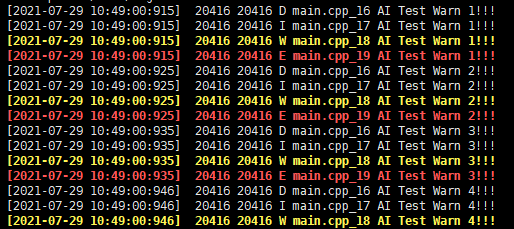

这是一个c++实现的日志打印和记录系统，使用在我们的ai项目中，这是一个最小系统。目的时展现日志系统的最小系统

## 主要流程如下


1. 系统启动时，启动日志系统
2. 日志系统会启动一个日志线程，用于在日志文件中记录日志，默认每512行日志，会统一同步到日志文件一次
3. 当处于debug模式，会实时的将日志同步到日志文件
4. 日志文件大小现在为4MB,超过该大小时，文件会被清空，防止日志文件过大


## 主要配置想如下
主要完成以下工作
1:对上一次启动日志系统的日志文件进行检查，如果存在上一次的日志系统，则修改日志文件的名称为最新之间的名称；如果不存在，则创建本次要保存的日志系统名称

日志的保存目录何明明规范如下

```
//AiLogIo.h
#define LOGFILE_PATH         "./data/ai_monitor/log"
#define AI_PREFIX           "aiheart"
#define LOG_EXT             ".log"
#define FILE_FOR_DEBUG       LOGFILE_PATH"/.debug"
#define MAX_LOG_FILE_SIZE (1024 *1024*4)//limit log file max 4M
```

> LOGFILE_PATH表示日志保存目录
> AI_PREFIX：日志文件名称前缀
> LOG_EXT：日志文件后缀
> FILE_FOR_DEBUG：日志目录下存在.debug文件时，属于debug模型，打印的日志会试试的写入到日志文件中
> MAX_LOG_FILE_SIZE：表示日志文件的最大大小，单位MB, 文件大小超过该大小时，会被情况。

其他关键参数
```
//AiLogIo.h
int g_cache_max_size = 512;

```

> g_cache_max_size：日志最大缓冲行数，超过该缓冲行数时，会将日志写入到日志文件中。当处于debug模式时，每一行都会实时的写入到日志文件，不受该参数限制

## 测试建议

1. 测试日志文件存在时，能否正确生成-通过
2. 测试日志缓冲到g_cache_max_size时，是否会同步到日志文件-通过
3. 重启日志系统时，日志文件的名称中时间字段是否会更新为最新的时间-通过
4. 日志文件超过限定大小时，是否会删除重置-通过
5. 停止日志系统的时候，文件写入应该时不再进行的。也就是说，日志可以正常打印在屏幕上，但不会写入到文件中-通过
6. 日志记录系统关闭的时候，日志应该能够正常打印，只是不记录到日志文件-通过
7. debug模式下日志文件最大为20MB,正常模式下日志文件最大为5MB

## 使用方法
```c++

#include "AiLog.h"
using namespace std;
using namespace aiheart;

int main()
{

Log::StartAiLogIo();

int count = 0;
while(true)
{
    std::this_thread::sleep_for(std::chrono::milliseconds(10));
    count++;
    LOGD("Test Warn %d!!!", count);
    LOGI("Test Warn %d!!!", count);
    LOGW("Test Warn %d!!!", count);
    LOGE("Test Warn %d!!!", count);
}


Log::StopAiLogIo();


return 1;

}
```

使用效果图：
日志打印效果如下



日志文件保存效果如下：
```
├── data
│   └── log
│       └── aiheart__20210729104900.log
```